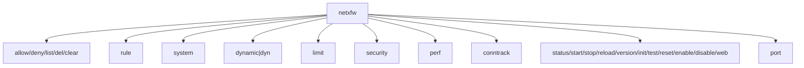
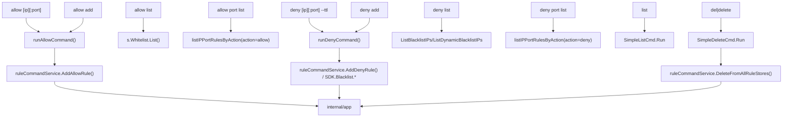
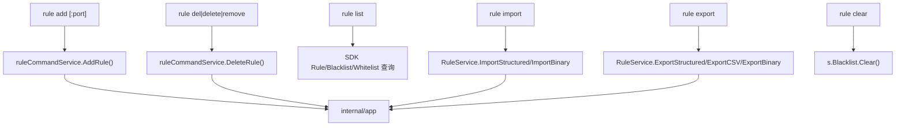
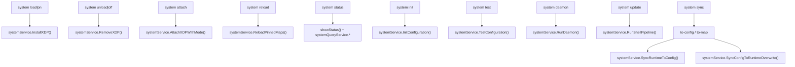
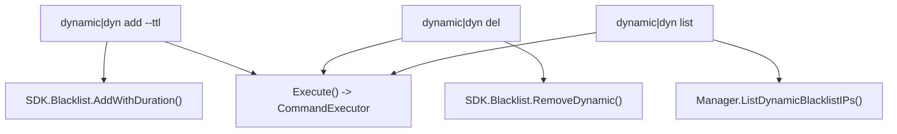
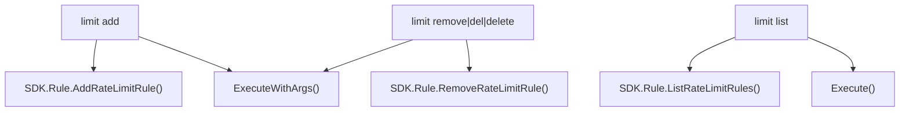
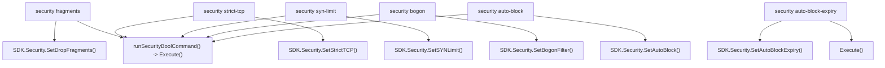
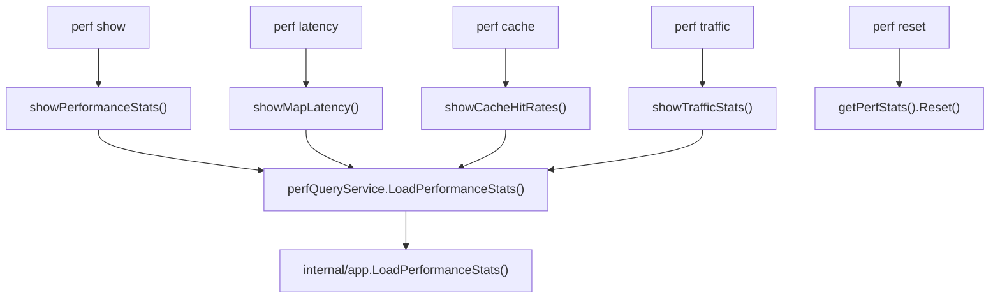
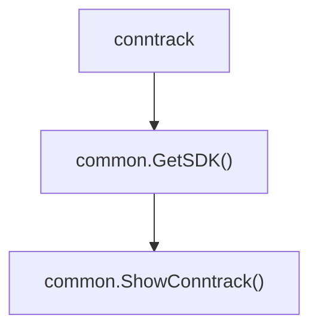
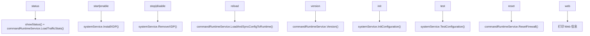

# 命令行手册 (CLI Manual)

`netxfw` 提供了一个简单的命令行界面，用于管理防火墙服务和操作 IP 规则列表。

## 通用标志

以下标志适用于大多数子命令：

| 标志 | 简写 | 说明 |
|---|---|---|
| `--config <path>` | `-c` | 指定配置文件路径（默认 `/etc/netxfw/config.toml`） |
| `--interface <name>` | `-i` | 指定网络接口 |
| `--mode <dp\|agent>` | - | 运行模式（`dp` 数据面 / `agent` 控制面） |

---

## 命令概览

### 快捷命令

| 命令 | 参数 | 说明 |
|---|---|---|
| `enable` | 无 | 启用并启动防火墙 |
| `disable` | 无 | 禁用并停止防火墙 |
| `status` | 无 | 查看系统状态 |
| `reload` | 无 | 重载配置并同步到 BPF Map |
| `reset` | 无 | 重置防火墙（清空所有规则，保留 SSH） |
| `init` | 无 | 初始化配置文件 |
| `test` | 无 | 测试配置文件有效性 |
| `version` | 无 | 查看版本信息 |
| `list` | [--limit N] | 列出所有封禁 IP（默认100条） |
| `clear` | 无 | 清空黑名单 |
| `del <ip>` | IP/CIDR | 从白名单或黑名单删除 IP |

### allow 白名单管理

| 命令 | 参数 | 说明 |
|---|---|---|
| `allow <ip>` | IP/CIDR | 快速添加白名单（向后兼容） |
| `allow add <ip>` | IP/CIDR | 添加 IP 到白名单 |
| `allow list` | [--limit N] | 列出白名单 IP（默认100条） |
| `allow port list` | 无 | 列出 IP+Port 允许规则 |

### deny 黑名单管理

| 命令 | 参数 | 说明 |
|---|---|---|
| `deny <ip> [--ttl]` | IP/CIDR [--ttl] | 添加 IP 到黑名单（向后兼容） |
| `deny add <ip> [--ttl]` | IP/CIDR [--ttl] | 添加 IP 到黑名单 |
| `deny list` | [--limit N] | 列出黑名单（静态+动态，默认100条） |
| `deny list --static` | [--limit N] | 仅列出静态黑名单 |
| `deny list --dynamic` | [--limit N] | 仅列出动态黑名单 |
| `deny port list` | 无 | 列出 IP+Port 拒绝规则 |

### dynamic 动态黑名单管理

| 命令 | 参数 | 说明 |
|---|---|---|
| `dynamic add <ip> --ttl <duration>` | IP, TTL | 添加动态黑名单（带过期时间） |
| `dynamic del <ip>` | IP/CIDR | 从动态黑名单移除 |
| `dynamic list` | 无 | 列出所有动态黑名单条目 |
| `dyn ...` | - | `dynamic` 的别名 |

### system 系统管理

| 命令 | 参数 | 说明 |
|---|---|---|
| `system on [iface...]` | 接口名 | 加载 XDP 程序（`load` 别名） |
| `system off [iface...]` | 接口名 | 卸载 XDP 程序（`unload` 别名） |
| `system load` | `-i <iface>` | 加载 XDP 驱动到指定接口 |
| `system unload` | `-i <iface>` | 卸载 XDP 驱动 |
| `system reload` | `-i <iface>` | 热重载 XDP 程序（无损更新） |
| `system daemon` | `-c -i` | 启动后台守护进程 |
| `system status` | `-c -i` | 查看运行时状态和统计信息 |
| `system init` | `-c` | 初始化默认配置文件 |
| `system test` | `-c` | 测试配置文件有效性 |
| `system update` | 无 | 从 GitHub 检查并安装更新 |
| `system sync to-config` | `-c -i` | 将 BPF Map 状态同步到配置文件 |
| `system sync to-map` | `-c -i` | 将配置文件加载到 BPF Map |

### rule 规则管理

| 命令 | 参数 | 说明 |
|---|---|---|
| `rule add <ip>[:port] <allow\|deny>` | IP, 端口, 动作 | 添加 IP 或 IP+端口规则 |
| `rule del <ip>` | IP/CIDR | 移除规则（`delete`/`remove` 别名） |
| `rule list` | 可选过滤参数 | 查看所有规则列表 |
| `rule import <type> <file>` | 类型, 文件 | 批量导入规则（TXT/JSON/TOML） |
| `rule export <file> [--format]` | 文件名, 格式 | 导出规则（JSON/TOML/CSV） |
| `rule clear` | 无 | 清空黑名单 |

### limit 限速管理

| 命令 | 参数 | 说明 |
|---|---|---|
| `limit add <ip> <rate> <burst>` | IP, 速率, 突发 | 为指定 IP 设置 PPS 限速 |
| `limit remove <ip>` | IP | 移除限速规则 |
| `limit list` | 无 | 查看所有限速规则 |

### security 安全策略

| 命令 | 参数 | 说明 |
|---|---|---|
| `security fragments <true\|false>` | 布尔值 | 启用/禁用分片包丢弃 |
| `security strict-tcp <true\|false>` | 布尔值 | 启用/禁用严格 TCP 标志验证 |
| `security syn-limit <true\|false>` | 布尔值 | 启用/禁用 SYN Flood 保护 |
| `security bogon <true\|false>` | 布尔值 | 启用/禁用 Bogon 过滤 |
| `security auto-block <true\|false>` | 布尔值 | 启用/禁用自动封锁 |
| `security auto-block-expiry <seconds>` | 秒数 | 设置自动封锁过期时间 |

### port 端口管理

| 命令 | 参数 | 说明 |
|---|---|---|
| `port add <port>` | 端口号 | 将端口加入全局允许列表 |
| `port remove <port>` | 端口号 | 从允许列表移除端口 |

### perf 性能监控

| 命令 | 参数 | 说明 |
|---|---|---|
| `perf show` | `-c -i` | 显示所有性能统计 |
| `perf latency` | `-c -i` | 显示 Map 操作延迟统计 |
| `perf cache` | `-c -i` | 显示缓存命中率统计 |
| `perf traffic` | `-c -i` | 显示实时流量统计（PPS/BPS/丢包率） |
| `perf reset` | `-c -i` | 重置性能统计计数器 |

### 其他

| 命令 | 参数 | 说明 |
|---|---|---|
| `conntrack` | 无 | 查看内核活跃连接追踪表 |
| `version` | `[--short]` | 查看版本及 SDK 状态 |
| `web` | 无 | 显示 Web 控制台信息 |

---

## 详细说明

### 1. XDP 程序管理

`netxfw` 提供多种方式管理 XDP 程序的加载和卸载：

| 功能 | 命令 |
|---|---|
| 加载 XDP | `netxfw system on eth0` 或 `netxfw system load -i eth0` |
| 卸载 XDP | `netxfw system off eth0` 或 `netxfw system unload -i eth0` |
| 卸载全部 | `netxfw system off` |
| 热重载 | `netxfw system reload -i eth0` |

```bash
# 加载到指定网卡
sudo netxfw system on eth0

# 加载到多个网卡
sudo netxfw system on eth0 eth1 eth2

# 使用配置文件中的默认网卡
sudo netxfw system on

# 卸载所有网卡上的 XDP
sudo netxfw system off

# 热重载（无损更新，不中断现有连接）
sudo netxfw system reload -i eth0
```

### 2. 系统状态 (system status)

显示防火墙运行状态、统计信息和资源利用率。

```bash
# 查看系统状态
sudo netxfw system status

# 指定配置文件
sudo netxfw system status -c /etc/netxfw/config.toml

# 查看特定接口的统计
sudo netxfw system status -i eth0
```

**输出内容包含**：流量速率、通过/丢弃统计（包括黑名单、限速、默认拒绝等原因）、连接追踪健康度、BPF Map 使用率、协议分布、安全策略概览、接口状态。

### 3. 白名单管理 (allow)

管理白名单 IP 列表，支持子命令和向后兼容模式。

```bash
# 向后兼容：快速添加白名单
sudo netxfw allow 1.2.3.4

# 子命令：添加白名单
sudo netxfw allow add 1.2.3.4

# 子命令：添加带端口的白名单
sudo netxfw allow add 1.2.3.4:443

# 子命令：列出白名单
sudo netxfw allow list

# 子命令：限制显示数量
sudo netxfw allow list --limit 50

# 子命令：列出 IP+Port 允许规则
sudo netxfw allow port list

# 从白名单移除
sudo netxfw unallow 1.2.3.4
```

### 4. 黑名单管理 (deny)

管理黑名单 IP 列表，支持静态黑名单和动态黑名单（带 TTL）。

```bash
# 向后兼容：添加到静态黑名单
sudo netxfw deny 1.2.3.4

# 向后兼容：添加到动态黑名单（带 TTL）
sudo netxfw deny 1.2.3.4 --ttl 1h

# 子命令：添加到静态黑名单
sudo netxfw deny add 1.2.3.4

# 子命令：添加到动态黑名单（带 TTL）
sudo netxfw deny add 1.2.3.4 --ttl 1h

# 子命令：列出所有黑名单（静态+动态）
sudo netxfw deny list

# 子命令：限制显示数量
sudo netxfw deny list --limit 50

# 子命令：仅列出静态黑名单
sudo netxfw deny list --static

# 子命令：仅列出动态黑名单
sudo netxfw deny list --dynamic

# 子命令：列出 IP+Port 拒绝规则
sudo netxfw deny port list
```

**TTL 格式支持**：`1h`（1小时）、`30m`（30分钟）、`1d`（1天）、`24h`（24小时）

**--limit 参数**：限制列表显示数量，默认为 100 条，防止大数据量时系统崩溃。

### 5. 动态黑名单管理 (dynamic)

专门管理动态黑名单（LRU Hash，自动过期）。

```bash
# 添加动态黑名单（必须指定 TTL）
sudo netxfw dynamic add 192.168.1.100 --ttl 1h

# 使用别名 dyn
sudo netxfw dyn add 10.0.0.1 --ttl 24h

# 删除动态黑名单条目
sudo netxfw dynamic del 192.168.1.100

# 使用 delete 别名
sudo netxfw dynamic delete 192.168.1.100

# 列出所有动态黑名单
sudo netxfw dynamic list
```

**输出示例**：
```
📋 Dynamic blacklist entries (2 total):
━━━━━━━━━━━━━━━━━━━━━━━━━━━━━━━━━━━━━━━━━━━━━━━━━━━━━━━━━━━━
  🚫 172.16.1.1/32 (expires: 2026-02-28 16:07:51)
  🚫 10.10.10.10/32 (expires: 2026-02-28 14:56:48)
```

### 6. 快捷封禁与解封

针对紧急情况的快捷命令，无需 SDK 子命令：

```bash
# 立即封禁 IP
sudo netxfw block 1.2.3.4

# 封禁 CIDR 网段
sudo netxfw block 192.168.100.0/24

# 立即解封
sudo netxfw unlock 1.2.3.4

# 清空黑名单
sudo netxfw clear
```

### 7. 规则管理 (rule)

支持细粒度的访问控制。

```bash
# 将 IP 加入白名单（允许所有流量）
sudo netxfw rule add 1.2.3.4 allow

# 将 IP 加入黑名单（封禁所有流量）
sudo netxfw rule add 5.6.7.8 deny

# 封禁特定 IP 访问特定端口
sudo netxfw rule add 5.6.7.8 80 deny

# 查看所有规则
sudo netxfw rule list

# 移除规则（支持 del/delete/remove 别名）
sudo netxfw rule del 1.2.3.4
sudo netxfw rule delete 1.2.3.4
sudo netxfw rule remove 1.2.3.4
```

### 8. 批量导入 (rule import)

支持从文本或结构化文件批量导入规则。

```bash
# 导入黑名单（每行一个 IP/CIDR）
sudo netxfw rule import deny blacklist.txt

# 导入白名单
sudo netxfw rule import allow whitelist.txt

# 从 JSON/TOML 文件导入所有规则
sudo netxfw rule import all rules.json
sudo netxfw rule import all rules.toml

# 从 bin.zst 文件导入黑名单（二进制压缩格式）
sudo netxfw rule import binary rules.deny.bin.zst
```

**文本格式**：每行一个 IP 或 CIDR，支持 `#` 注释。

**JSON 格式**：
```json
{
  "blacklist": [{"type": "blacklist", "ip": "10.0.0.1"}],
  "whitelist": [{"type": "whitelist", "ip": "127.0.0.1/32"}],
  "ipport_rules": [{"type": "ipport", "ip": "192.168.1.1", "port": 80, "action": "allow"}]
}
```

**Binary 格式（.bin.zst）**：
- 高性能二进制格式，使用 zstd 压缩
- 仅支持黑名单规则
- 适合大规模规则存储和快速迁移
- 文件扩展名必须为 `.bin.zst`

### 6. 规则导出 (rule export)

```bash
# 导出为 JSON（默认）
sudo netxfw rule export rules.json

# 导出为 TOML
sudo netxfw rule export rules.toml --format toml

# 导出为 CSV
sudo netxfw rule export rules.csv --format csv

# 导出为 Binary 格式（仅黑名单，zstd 压缩）
sudo netxfw rule export rules.deny.bin.zst --format binary

# 自动检测格式（根据文件扩展名）
sudo netxfw rule export rules.json
sudo netxfw rule export rules.toml
sudo netxfw rule export rules.csv
sudo netxfw rule export rules.deny.bin.zst
```

**格式对比**：

| 格式 | 优点 | 缺点 | 适用场景 |
|------|------|------|----------|
| **文本** | 简单易读，手动编辑方便 | 功能有限，仅支持单一规则类型 | 快速添加少量 IP |
| **JSON/TOML** | 结构化，包含所有规则类型，易读 | 文件较大，解析较慢 | 配置备份、版本控制 |
| **CSV** | 表格格式，便于 Excel 编辑 | 文件较大，不支持复杂结构 | 数据交换、报表 |
| **Binary** | 高性能，压缩率高，解析快 | 不可读，仅支持黑名单 | 大规模规则存储、快速迁移 |

### 7. 限速管理 (limit)

在 XDP 层对指定 IP 或网段进行 PPS（每秒包数）限速，支持 IPv4/IPv6/CIDR。

```bash
# 限制 1000 pps，最大突发 2000
sudo netxfw limit add 1.2.3.4 1000 2000

# 限制 IPv6 地址
sudo netxfw limit add 2001:db8::1 500 1000

# 限制整个网段
sudo netxfw limit add 192.168.1.0/24 5000 10000

# 查看限速规则
sudo netxfw limit list

# 移除限速规则
sudo netxfw limit remove 1.2.3.4
```

### 8. 安全策略 (security)

动态调整防火墙的安全行为，立即生效，无需重载。

```bash
# 禁用分片包丢弃
sudo netxfw security fragments false

# 启用严格 TCP 标志验证
sudo netxfw security strict-tcp true

# 启用 SYN Flood 保护
sudo netxfw security syn-limit true

# 启用 Bogon 过滤
sudo netxfw security bogon true

# 启用自动封锁
sudo netxfw security auto-block true

# 设置自动封锁过期时间（600 秒）
sudo netxfw security auto-block-expiry 600
```

### 9. 端口管理 (port)

管理全局允许端口列表。

```bash
# 允许特定端口
sudo netxfw port add 8080

# 移除允许端口
sudo netxfw port remove 8080
```

### 10. 配置同步 (system sync)

在 BPF Map（运行时）与配置文件（磁盘）之间双向同步。

```bash
# 将运行时状态持久化到配置文件
sudo netxfw system sync to-config

# 将配置文件重新加载到运行时
sudo netxfw system sync to-map
```

### 11. 性能监控 (perf)

```bash
sudo netxfw perf show       # 显示所有性能统计
sudo netxfw perf latency    # Map 操作延迟
sudo netxfw perf cache      # 缓存命中率
sudo netxfw perf traffic    # 实时流量 PPS/BPS
sudo netxfw perf reset      # 重置统计计数器
```

### 12. 守护进程模式 (system daemon)

```bash
# 使用配置文件中指定的接口启动
sudo netxfw system daemon

# 指定接口启动
sudo netxfw system daemon -i eth0

# 指定配置文件和接口
sudo netxfw system daemon -c /etc/netxfw/config.toml -i eth0
```

> **PID 文件说明**：
> - 指定接口时：`/var/run/netxfw_<interface>.pid`（支持多实例并行）
> - 未指定接口时：`/var/run/netxfw.pid`

### 13. 版本信息 (version)

```bash
netxfw version           # 详细版本及 SDK 状态
netxfw version --short   # 仅输出版本号（适用于脚本）
```

### 14. 配置初始化与验证

```bash
# 初始化默认配置文件
sudo netxfw system init

# 测试配置文件是否有效
sudo netxfw system test

# 手动检查并安装更新
sudo netxfw system update
```

## 调用链图

本节给出命令到实现的真实调用关系，统一按三层表达：
`命令 -> cmd 实现 -> application/service 或 SDK`。

### 1) Root 注册总览



源码锚点：`cmd/netxfw/root.go`；命令实现 `cmd/agent/*.go`、`cmd/dp/conntrack.go`；执行框架 `cmd/agent/executor.go`；服务入口 `internal/application/services/*`。

### 2) allow/deny/list/del（含 port list）



源码锚点：`cmd/agent/simple_list.go`；执行框架 `cmd/agent/executor.go`；服务入口 `internal/application/services/rule_command_service.go`。

### 3) rule（add/del/list/import/export/clear）



源码锚点：`cmd/agent/rule.go`；执行框架 `cmd/agent/executor.go`；服务入口 `internal/application/services/rule_command_service.go`、`internal/application/services/rule_service.go`。

### 4) system（attach/load/unload/on/off/reload/status/sync/test/init/daemon/update）



源码锚点：`cmd/agent/system.go`、`cmd/agent/system_display.go`、`cmd/agent/system_stats.go`；执行框架 `cmd/agent/executor.go`；服务入口 `internal/application/services/system_service.go`、`internal/application/services/system_query_service.go`。

### 5) dynamic（add/del/list，别名 dyn）



源码锚点：`cmd/agent/dynamic.go`；执行框架 `cmd/agent/executor.go`。

### 6) limit（add/remove/list）



源码锚点：`cmd/agent/limit.go`；执行框架 `cmd/agent/executor.go`。

### 7) security（6 个子命令）



源码锚点：`cmd/agent/security.go`；执行框架 `cmd/agent/executor.go`。

### 8) perf（show/latency/cache/traffic/reset）



源码锚点：`cmd/agent/perf.go`；执行框架 `cmd/agent/executor.go`；服务入口 `internal/application/services/performance_query_service.go`。

### 9) conntrack



源码锚点：`cmd/dp/conntrack.go`、`cmd/common/utils.go`、`cmd/common/display.go`。

### 10) 简化命令（status/start/stop/reload/version/init/test/reset/enable/disable/web）



源码锚点：`cmd/agent/simple.go`；执行框架 `cmd/agent/executor.go`；服务入口 `internal/application/services/command_runtime_service.go`、`internal/application/services/system_service.go`。

## 维护规则

1. 新增/删除任一 CLI 命令或子命令时，必须同步更新本节对应 Mermaid 图。  
2. 命令别名变化（如 `del|delete`、`dynamic|dyn`、`on|load`、`off|unload`）必须在图中显式标注。  
3. 若调用链由 `SDK` 迁移到 `application/services`（或反向），需同步更新图与“源码锚点”。  
4. 合并前至少执行一次：`./netxfw --help` 与 `./netxfw <group> --help`（`rule/system/allow/deny/dynamic/limit/security/perf`）确认节点一致。  

## 抽样链路核对（2026-04-11）

1. `rule export <file>`  
链路：`netxfw` -> `rule` -> `export` -> `ruleExportCmd.Run` -> `Execute(...)` -> `RuleService.ExportStructured/ExportCSV/ExportBinary`。  
锚点：`cmd/netxfw/root.go:72`、`cmd/agent/rule.go:438`、`cmd/agent/rule.go:450`、`cmd/agent/executor.go:165`、`internal/application/services/rule_service.go:28`。

2. `system sync to-map`  
链路：`netxfw` -> `system` -> `sync` -> `to-map` -> `syncToMapCmd.Run` -> `Execute(...)` -> `SystemService.SyncConfigToRuntimeOverwrite`。  
锚点：`cmd/netxfw/root.go:92`、`cmd/agent/system.go:383`、`cmd/agent/system.go:388`、`cmd/agent/executor.go:165`、`internal/application/services/system_service.go:41`。

3. `deny port list`  
链路：`netxfw` -> `deny` -> `port` -> `list` -> `denyPortListCmd.Run` -> `CommandExecutor.ExecuteWithSDK(...)` -> `listIPPortRulesByAction(...)` -> `s.GetManager().ListIPPortRules(...)`。  
锚点：`cmd/netxfw/root.go:58`、`cmd/agent/simple_list.go:359`、`cmd/agent/simple_list.go:365`、`cmd/agent/executor.go:94`、`cmd/agent/simple_list.go:539`。

4. `dynamic add <ip> --ttl <duration>`  
链路：`netxfw` -> `dynamic|dyn` -> `add` -> `dynamicAddCmd.Run` -> `Execute(...)` -> `s.Blacklist.AddWithDuration(...)`。  
锚点：`cmd/netxfw/root.go:76`、`cmd/agent/dynamic.go:34`、`cmd/agent/dynamic.go:49`、`cmd/agent/executor.go:165`、`cmd/agent/dynamic.go:69`。

5. `perf show`  
链路：`netxfw` -> `perf` -> `show` -> `perfShowCmd.Run` -> `Execute(...)` -> `showPerformanceStats(...)` -> `perfQueryService.LoadPerformanceStats(...)`。  
锚点：`cmd/netxfw/root.go:83`、`cmd/agent/perf.go:27`、`cmd/agent/perf.go:33`、`cmd/agent/perf.go:130`、`internal/application/services/performance_query_service.go:21`。
