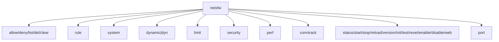
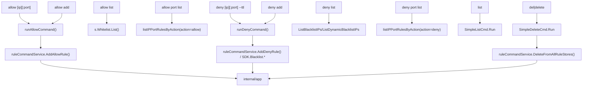
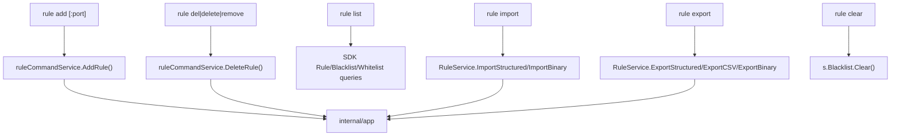
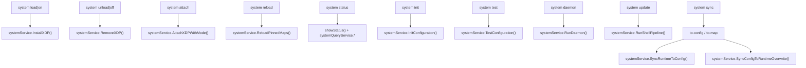
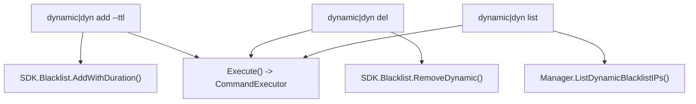
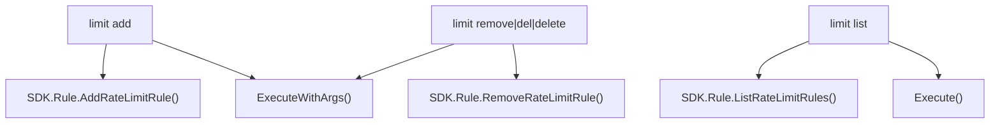
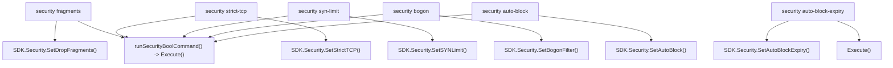
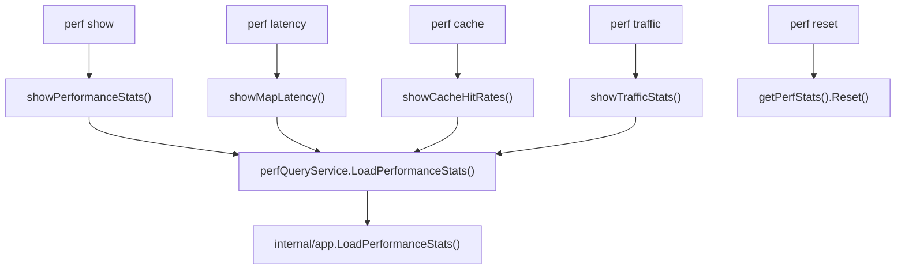
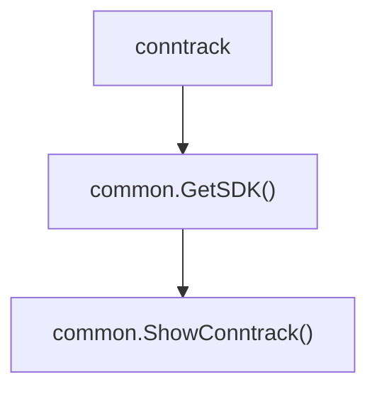
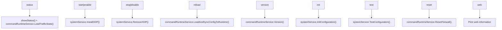

# CLI Manual

`netxfw` provides a simple command-line interface for managing the firewall and IP rule lists.

## Global Flags

The following flags are available on most subcommands:

| Flag | Short | Description |
|---|---|---|
| `--config <path>` | `-c` | Path to config file (default: `/etc/netxfw/config.toml`) |
| `--interface <name>` | `-i` | Network interface to target |
| `--mode <dp\|agent>` | - | Operation mode: `dp` (Data Plane) / `agent` (Control Plane) |

---

## Command Overview

### Quick Commands

| Command | Arguments | Description |
|---|---|---|
| `enable` | None | Enable and start the firewall |
| `disable` | None | Disable and stop the firewall |
| `status` | None | Show system status |
| `reload` | None | Reload configuration and sync to BPF maps |
| `reset` | None | Reset firewall (clear all rules, preserve SSH) |
| `init` | None | Initialize configuration file |
| `test` | None | Test configuration validity |
| `version` | None | Show version information |
| `list` | [--limit N] | List all blocked IPs (default: 100) |
| `clear` | None | Clear the entire blacklist |
| `del <ip>` | IP/CIDR | Delete IP from whitelist or blacklist |

### allow — Whitelist Management

| Command | Arguments | Description |
|---|---|---|
| `allow <ip>` | IP/CIDR | Quickly whitelist an IP (backward compatible) |
| `allow add <ip>` | IP/CIDR | Add IP to whitelist |
| `allow list` | [--limit N] | List whitelist IPs (default: 100) |
| `allow port list` | None | List IP+Port allow rules |

### deny — Blacklist Management

| Command | Arguments | Description |
|---|---|---|
| `deny <ip> [--ttl]` | IP/CIDR [--ttl] | Add IP to blacklist (backward compatible) |
| `deny add <ip> [--ttl]` | IP/CIDR [--ttl] | Add IP to blacklist |
| `deny list` | [--limit N] | List blacklist (static + dynamic, default: 100) |
| `deny list --static` | [--limit N] | List static blacklist only |
| `deny list --dynamic` | [--limit N] | List dynamic blacklist only |
| `deny port list` | None | List IP+Port deny rules |

### dynamic — Dynamic Blacklist Management

| Command | Arguments | Description |
|---|---|---|
| `dynamic add <ip> --ttl <duration>` | IP, TTL | Add to dynamic blacklist (with expiry) |
| `dynamic del <ip>` | IP/CIDR | Remove from dynamic blacklist |
| `dynamic list` | None | List all dynamic blacklist entries |
| `dyn ...` | - | Alias for `dynamic` |

### system — System Management

| Command | Flags | Description |
|---|---|---|
| `system on [iface...]` | positional args | Load XDP program (alias for `load`) |
| `system off [iface...]` | positional args | Unload XDP program (alias for `unload`) |
| `system load` | `-i <iface>` | Load XDP driver onto interface |
| `system unload` | `-i <iface>` | Unload XDP driver |
| `system reload` | `-i <iface>` | Hot-reload XDP program (lossless) |
| `system daemon` | `-c -i` | Start background daemon process |
| `system status` | `-c -i` | Show runtime status and statistics |
| `system init` | `-c` | Initialize default configuration file |
| `system test` | `-c` | Test configuration validity |
| `system update` | None | Check and install updates from GitHub |
| `system sync to-config` | `-c -i` | Dump BPF maps → config file (persist) |
| `system sync to-map` | `-c -i` | Load config file → BPF maps |

### rule — Rule Management

| Command | Arguments | Description |
|---|---|---|
| `rule add <ip>[:port] <allow\|deny>` | IP, port, action | Add IP or IP+Port rule |
| `rule del <ip>` | IP/CIDR | Remove a rule (`delete`/`remove` alias) |
| `rule list` | optional filters | List all rules |
| `rule import <type> <file>` | type, file | Bulk import rules (TXT/JSON/TOML) |
| `rule export <file> [--format]` | file, format | Export rules (JSON/TOML/CSV) |
| `rule clear` | None | Clear the blacklist |

### limit — Rate Limiting

| Command | Arguments | Description |
|---|---|---|
| `limit add <ip> <rate> <burst>` | IP, pps, burst | Set PPS rate limit for an IP |
| `limit remove <ip>` | IP | Remove a rate limit rule |
| `limit list` | None | List all rate limit rules |

### security — Security Policies

| Command | Arguments | Description |
|---|---|---|
| `security fragments <true\|false>` | bool | Enable/disable dropping fragmented packets |
| `security strict-tcp <true\|false>` | bool | Enable/disable strict TCP flag validation |
| `security syn-limit <true\|false>` | bool | Enable/disable SYN flood protection |
| `security bogon <true\|false>` | bool | Enable/disable bogon IP filtering |
| `security auto-block <true\|false>` | bool | Enable/disable auto-blocking |
| `security auto-block-expiry <seconds>` | int | Set auto-block expiry duration |

### port — Port Management

| Command | Arguments | Description |
|---|---|---|
| `port add <port>` | port number | Add port to global allow list |
| `port remove <port>` | port number | Remove port from allow list |

### perf — Performance Monitoring

| Command | Flags | Description |
|---|---|---|
| `perf show` | `-c -i` | Show all performance statistics |
| `perf latency` | `-c -i` | Show BPF map operation latency |
| `perf cache` | `-c -i` | Show cache hit rate statistics |
| `perf traffic` | `-c -i` | Show real-time traffic (PPS/BPS/drops) |
| `perf reset` | `-c -i` | Reset all performance counters |

### Other

| Command | Arguments | Description |
|---|---|---|
| `conntrack` | None | Show active kernel connection tracking table |
| `version` | `[--short]` | Show version and SDK status |
| `web` | None | Show Web UI information |

---

## Detailed Reference

### 1. XDP Program Management

`netxfw` provides several ways to load and unload the XDP program:

| Action | Command |
|---|---|
| Load XDP | `netxfw system on eth0` or `netxfw system load -i eth0` |
| Unload XDP | `netxfw system off eth0` or `netxfw system unload -i eth0` |
| Unload all | `netxfw system off` |
| Hot-reload | `netxfw system reload -i eth0` |

```bash
# Load onto a specific interface
sudo netxfw system on eth0

# Load onto multiple interfaces
sudo netxfw system on eth0 eth1 eth2

# Use default interfaces from config
sudo netxfw system on

# Unload all interfaces
sudo netxfw system off

# Hot-reload: applies new config without dropping connections
sudo netxfw system reload -i eth0
```

### 2. System Status (system status)

Displays runtime status, statistics, and resource utilization.

```bash
# Show system status (all interfaces)
sudo netxfw system status

# Use a custom config file
sudo netxfw system status -c /etc/netxfw/config.toml

# Show stats for a specific interface
sudo netxfw system status -i eth0
```

**Output includes**: traffic rates, pass/drop counters (including blacklist, rate-limit, default-deny reasons), conntrack health, BPF map usage, protocol distribution, policy configuration, attached interfaces.

### 3. Whitelist Management (allow)

Manage whitelist IP list with subcommands and backward compatibility.

```bash
# Backward compatible: quick whitelist
sudo netxfw allow 1.2.3.4

# Subcommand: add to whitelist
sudo netxfw allow add 1.2.3.4

# Subcommand: add with port
sudo netxfw allow add 1.2.3.4:443

# Subcommand: list whitelist
sudo netxfw allow list

# Subcommand: limit display count
sudo netxfw allow list --limit 50

# Subcommand: list IP+Port allow rules
sudo netxfw allow port list

# Remove from whitelist
sudo netxfw unallow 1.2.3.4
```

### 4. Blacklist Management (deny)

Manage blacklist IP list with support for static and dynamic blacklists (with TTL).

```bash
# Backward compatible: add to static blacklist
sudo netxfw deny 1.2.3.4

# Backward compatible: add to dynamic blacklist (with TTL)
sudo netxfw deny 1.2.3.4 --ttl 1h

# Subcommand: add to static blacklist
sudo netxfw deny add 1.2.3.4

# Subcommand: add to dynamic blacklist (with TTL)
sudo netxfw deny add 1.2.3.4 --ttl 1h

# Subcommand: list all blacklist (static + dynamic)
sudo netxfw deny list

# Subcommand: limit display count
sudo netxfw deny list --limit 50

# Subcommand: list static blacklist only
sudo netxfw deny list --static

# Subcommand: list dynamic blacklist only
sudo netxfw deny list --dynamic

# Subcommand: list IP+Port deny rules
sudo netxfw deny port list
```

**TTL Format Support**: `1h` (1 hour), `30m` (30 minutes), `1d` (1 day), `24h` (24 hours)

**--limit Parameter**: Limits the number of results displayed, defaults to 100 to prevent system crash with large datasets.

### 5. Dynamic Blacklist Management (dynamic)

Dedicated management for dynamic blacklist (LRU Hash with auto-expiry).

```bash
# Add to dynamic blacklist (TTL required)
sudo netxfw dynamic add 192.168.1.100 --ttl 1h

# Using dyn alias
sudo netxfw dyn add 10.0.0.1 --ttl 24h

# Remove from dynamic blacklist
sudo netxfw dynamic del 192.168.1.100

# Using delete alias
sudo netxfw dynamic delete 192.168.1.100

# List all dynamic blacklist entries
sudo netxfw dynamic list
```

**Output Example**:
```
📋 Dynamic blacklist entries (2 total):
━━━━━━━━━━━━━━━━━━━━━━━━━━━━━━━━━━━━━━━━━━━━━━━━━━━━━━━━━━━━
  🚫 172.16.1.1/32 (expires: 2026-02-28 16:07:51)
  🚫 10.10.10.10/32 (expires: 2026-02-28 14:56:48)
```

### 6. Quick Commands (block/unlock/clear)

Fast-path commands for emergency situations — no subcommand required:

```bash
# Block an IP immediately
sudo netxfw block 1.2.3.4

# Block an entire subnet
sudo netxfw block 192.168.100.0/24

# Unblock an IP
sudo netxfw unlock 1.2.3.4

# Clear the entire blacklist
sudo netxfw clear
```

### 7. Rule Management (rule)

Fine-grained access control for IPs, CIDRs, and IP+Port combinations.

```bash
# Whitelist an IP (allow all traffic)
sudo netxfw rule add 1.2.3.4 allow

# Blacklist an IP (block all traffic)
sudo netxfw rule add 5.6.7.8 deny

# Block a specific IP:port
sudo netxfw rule add 5.6.7.8 80 deny

# List all rules
sudo netxfw rule list

# Remove a rule (supports del/delete/remove aliases)
sudo netxfw rule del 1.2.3.4
sudo netxfw rule delete 1.2.3.4
sudo netxfw rule remove 1.2.3.4
```

### 8. Bulk Import (rule import)

Import rules from text or structured files.

```bash
# Import blacklist (one IP/CIDR per line)
sudo netxfw rule import deny blacklist.txt

# Import whitelist
sudo netxfw rule import allow whitelist.txt

# Import all rules from JSON/TOML
sudo netxfw rule import all rules.json
sudo netxfw rule import all rules.toml

# Import blacklist from bin.zst file (binary compressed format)
sudo netxfw rule import binary rules.deny.bin.zst
```

**Text format**: one IP or CIDR per line, `#` comments supported.

**JSON format**:
```json
{
  "blacklist": [{"type": "blacklist", "ip": "10.0.0.1"}],
  "whitelist": [{"type": "whitelist", "ip": "127.0.0.1/32"}],
  "ipport_rules": [{"type": "ipport", "ip": "192.168.1.1", "port": 80, "action": "allow"}]
}
```

**Binary format (.bin.zst)**:
- High-performance binary format with zstd compression
- Supports blacklist rules only
- Ideal for large-scale rule storage and fast migration
- File extension must be `.bin.zst`

### 6. Rule Export (rule export)

```bash
# Export as JSON (default)
sudo netxfw rule export rules.json

# Export as TOML
sudo netxfw rule export rules.toml --format toml

# Export as CSV
sudo netxfw rule export rules.csv --format csv

# Export as Binary format (blacklist only, zstd compressed)
sudo netxfw rule export rules.deny.bin.zst --format binary

# Auto-detect format (based on file extension)
sudo netxfw rule export rules.json
sudo netxfw rule export rules.toml
sudo netxfw rule export rules.csv
sudo netxfw rule export rules.deny.bin.zst
```

**Format Comparison**:

| Format | Pros | Cons | Use Cases |
|--------|------|------|-----------|
| **Text** | Simple, human-readable, easy to edit | Limited functionality, single rule type only | Quick addition of few IPs |
| **JSON/TOML** | Structured, includes all rule types, readable | Larger file size, slower parsing | Config backup, version control |
| **CSV** | Tabular format, easy to edit in Excel | Large file size, no complex structure support | Data exchange, reporting |
| **Binary** | High performance, high compression ratio, fast parsing | Not human-readable, blacklist only | Large-scale rule storage, fast migration |

### 7. Rate Limiting (limit)

XDP-layer PPS rate limiting per IP or subnet. Supports IPv4, IPv6, and CIDR.

```bash
# Limit to 1000 pps, burst up to 2000
sudo netxfw limit add 1.2.3.4 1000 2000

# Limit an IPv6 address
sudo netxfw limit add 2001:db8::1 500 1000

# Limit a subnet
sudo netxfw limit add 192.168.1.0/24 5000 10000

# List active rate limits
sudo netxfw limit list

# Remove a rate limit
sudo netxfw limit remove 1.2.3.4
```

### 8. Security Policies (security)

Dynamically adjust firewall security behavior. Changes take effect immediately without a reload.

```bash
# Disable dropping of fragmented packets
sudo netxfw security fragments false

# Enable strict TCP flag validation
sudo netxfw security strict-tcp true

# Enable SYN flood protection
sudo netxfw security syn-limit true

# Enable bogon IP filtering
sudo netxfw security bogon true

# Enable auto-block for rate-limit violators
sudo netxfw security auto-block true

# Set auto-block expiry to 10 minutes
sudo netxfw security auto-block-expiry 600
```

### 9. Port Management (port)

Manage the global list of allowed source/destination ports.

```bash
# Allow a port globally
sudo netxfw port add 8080

# Remove a port from the allow list
sudo netxfw port remove 8080
```

### 10. Configuration Sync (system sync)

Bidirectional synchronization between BPF maps (runtime) and `config.toml` (disk).

```bash
# Persist runtime state to config file (Memory → Disk)
sudo netxfw system sync to-config

# Reload config file into runtime BPF maps (Disk → Memory)
sudo netxfw system sync to-map
```

### 11. Performance Monitoring (perf)

```bash
sudo netxfw perf show       # All performance statistics
sudo netxfw perf latency    # BPF map operation latency
sudo netxfw perf cache      # Cache hit rates
sudo netxfw perf traffic    # Real-time PPS/BPS/drop rates
sudo netxfw perf reset      # Reset all counters
```

### 12. Daemon Mode (system daemon)

```bash
# Start with interfaces from config
sudo netxfw system daemon

# Start on a specific interface
sudo netxfw system daemon -i eth0

# Start with a custom config and interface
sudo netxfw system daemon -c /etc/netxfw/config.toml -i eth0
```

> **PID File Behavior**:
> - With specific interfaces: `/var/run/netxfw_<interface>.pid` (supports multiple parallel instances)
> - Without specifying an interface: `/var/run/netxfw.pid`

### 13. Version (version)

```bash
netxfw version           # Detailed version and runtime SDK status
netxfw version --short   # Version string only (for scripting)
```

### 14. Config Init, Test & Update

```bash
# Initialize a fresh default config
sudo netxfw system init

# Validate the current config file
sudo netxfw system test

# Check for and install the latest update
sudo netxfw system update
```

## Call Graphs

This section documents the real command call paths using a 3-layer model:
`command -> cmd implementation -> application/service or SDK`.

### 1) Root Registration Overview



Source anchors: `cmd/netxfw/root.go`; command handlers in `cmd/agent/*.go` and `cmd/dp/conntrack.go`; execution framework `cmd/agent/executor.go`; service entrypoints `internal/app/*`.

### 2) allow/deny/list/del (including port list)



Source anchors: `cmd/agent/simple_list.go`; execution framework `cmd/agent/executor.go`; service entrypoint `internal/app/rule_service.go`.

### 3) rule (add/del/list/import/export/clear)



Source anchors: `cmd/agent/rule.go`; execution framework `cmd/agent/executor.go`; service entrypoint `internal/app/rule_service.go`.

### 4) system (attach/load/unload/on/off/reload/status/sync/test/init/daemon/update)



Source anchors: `cmd/agent/system.go`, `cmd/agent/system_display.go`, `cmd/agent/system_stats.go`; execution framework `cmd/agent/executor.go`; service entrypoints `internal/app/ops_xdp.go`, `internal/app/rule_service.go`.

### 5) dynamic (add/del/list, alias dyn)



Source anchors: `cmd/agent/dynamic.go`; execution framework `cmd/agent/executor.go`.

### 6) limit (add/remove/list)



Source anchors: `cmd/agent/limit.go`; execution framework `cmd/agent/executor.go`.

### 7) security (6 subcommands)



Source anchors: `cmd/agent/security.go`; execution framework `cmd/agent/executor.go`.

### 8) perf (show/latency/cache/traffic/reset)



Source anchors: `cmd/agent/perf.go`; execution framework `cmd/agent/executor.go`; service entrypoint `internal/app/ops_stats.go`.

### 9) conntrack



Source anchors: `cmd/dp/conntrack.go`, `cmd/common/utils.go`, `cmd/common/display.go`.

### 10) Simplified commands (status/start/stop/reload/version/init/test/reset/enable/disable/web)



Source anchors: `cmd/agent/simple.go`; execution framework `cmd/agent/executor.go`; service entrypoints `cmd/agent/runtime_support.go`, `internal/app/`.

## Maintenance Rules

1. When any CLI command/subcommand is added or removed, update the corresponding Mermaid graph in this section.
2. Alias changes (such as `del|delete`, `dynamic|dyn`, `on|load`, `off|unload`) must be explicitly reflected in graphs.
3. If call paths move between `SDK` and `application/services`, update both the graph and source-anchor line.
4. Before merge, run at least: `./netxfw --help` and `./netxfw <group> --help` for `rule/system/allow/deny/dynamic/limit/security/perf`.

## Sampled Call-Path Verification (2026-04-11)

1. `rule export <file>`  
Path: `netxfw` -> `rule` -> `export` -> `ruleExportCmd.Run` -> `Execute(...)` -> `RuleService.ExportStructured/ExportCSV/ExportBinary`.  
Anchors: `cmd/netxfw/root.go:72`, `cmd/agent/rule.go:429`, `cmd/agent/rule.go:441`, `cmd/agent/executor.go:165`, `internal/app/rule_service.go:30`.

2. `system sync to-map`  
Path: `netxfw` -> `system` -> `sync` -> `to-map` -> `syncToMapCmd.Run` -> `Execute(...)` -> `SystemService.SyncConfigToRuntimeOverwrite`.  
Anchors: `cmd/netxfw/root.go:92`, `cmd/agent/system_xdp_commands.go:186`, `cmd/agent/system_xdp_commands.go:191`, `cmd/agent/executor.go:165`, `internal/app/rule_service.go:72`.

3. `deny port list`  
Path: `netxfw` -> `deny` -> `port` -> `list` -> `denyPortListCmd.Run` -> `CommandExecutor.ExecuteWithSDK(...)` -> `listIPPortRulesByAction(...)` -> `s.GetManager().ListIPPortRules(...)`.  
Anchors: `cmd/netxfw/root.go:58`, `cmd/agent/simple_list.go:359`, `cmd/agent/simple_list.go:365`, `cmd/agent/executor.go:94`, `cmd/agent/simple_list.go:539`.

4. `dynamic add <ip> --ttl <duration>`  
Path: `netxfw` -> `dynamic|dyn` -> `add` -> `dynamicAddCmd.Run` -> `Execute(...)` -> `s.Blacklist.AddWithDuration(...)`.  
Anchors: `cmd/netxfw/root.go:76`, `cmd/agent/dynamic.go:34`, `cmd/agent/dynamic.go:49`, `cmd/agent/executor.go:165`, `cmd/agent/dynamic.go:69`.

5. `perf show`  
Path: `netxfw` -> `perf` -> `show` -> `perfShowCmd.Run` -> `Execute(...)` -> `showPerformanceStats(...)` -> `perfQueryService.LoadPerformanceStats(...)`.  
Anchors: `cmd/netxfw/root.go:83`, `cmd/agent/perf.go:24`, `cmd/agent/perf.go:30`, `cmd/agent/perf.go:122`, `internal/app/ops_stats.go:10`.
