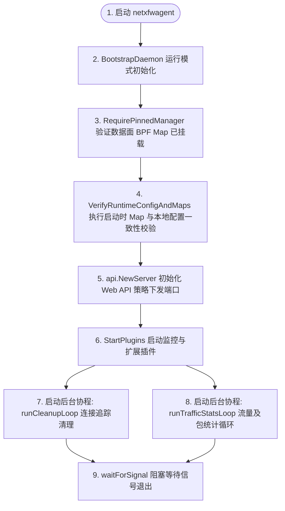

# Netxfw 项目架构与核心流量流程报告

本报告详细介绍了基于 eBPF/XDP 的高性能防火墙系统 **netxfw** 的项目结构、服务启动流程以及内核与用户态的交互设计。

本报告采用：
1. **系统高层执行逻辑 (Mermaid 流程图)**。
2. **核心文件级高精细调用图 (Fireworks - 翡翠专业风格 Style 7)**。
3. **底层代码级联调用时序步骤 (带源码行号导航)**。

通过多维度的拆解，彻底解决全局拓扑图过于杂乱、字迹模糊、连线错综复杂的问题。

---

## 一、 系统核心执行流程 (Mermaid 流程图)

### 1. 数据面 (Dataplane - netxfwdp) 启动与初始化流程


#### 流程步骤说明：
1. **启动初始化** ➔ 启动守护进程并进行日志环境准备 (`BootstrapDaemon`, `managePidFile`)
2. **加载TOML配置** ➔ 读取系统网络及容量等全局定义 (`LoadRuntimeConfigSnapshot`)
3. **驱动初始化与内存解锁** ➔ 解锁 Linux 内存上限并创建管理器实体 (`RemoveMemlock`)
4. **BPF字节码加载内核** ➔ 加载 Spec 重写 Map 的 MaxEntries，将对象载入内核 (`LoadAndAssign`)
5. **XDP/TC 网卡绑定挂载** ➔ 执行 XDP 原生/降级模式绑定，固定 Pinned 链接 (`Attach`)
6. **安全模块启动守护** ➔ 实例化安全过滤链并启动后台线程，阻塞等待控制信号 (`waitForSignal`)

### 2. 控制面代理 (Agent - netxfwagent) 策略管理流程



---

## 二、 核心文件级高精细调用图 (翡翠专业风格 Style 7)

为了提供最高的字迹对比度与连线清晰度，我们采用了全新的 **Emerald Professional (翡翠专业风格 - Style 7)**，针对文件层级进行了定向导出，极大减少了标准库和底层冗余结构体带来的杂噪线段。

````carousel

<!-- slide -->

<!-- slide -->

````

---

## 三、 底层代码级联调用时序步骤 (文字精细导航)

以下为您列出核心子模块在执行底层操作时的 **精确函数调用顺序与代码坐标**，以作为图表的补充对照：

### 1. eBPF/XDP 管理器初始化流程 (`NewManager`)
当服务加载或创建新的底层驱动时，按以下顺序执行代码调用：
1. **移除内核锁限制**：
   * 调用 `rlimit.RemoveMemlock()` 移除内核对锁定物理内存的上限限制。
   * 源码位置：[xdp_manager.go:L51](../internal/datapath/xdp/backend/xdp_manager.go#L51)
2. **加载并调整 BPF 规范**：
   * 调用 `LoadNetXfw()` 加载动态编译生成的 ELF 字节码规范。
   * 根据容量配置限制，动态重写 `spec.Maps` 的 `MaxEntries` 大小（如黑名单、白名单及连接追踪表）。
   * 源码位置：[xdp_manager.go:L56-L83](../internal/datapath/xdp/backend/xdp_manager.go#L56-L83)
3. **装载 BPF 结构到内核**：
   * 调用 `spec.LoadAndAssign(&objs, nil)` 将生成的 BPF map 和程序真正加载至 Linux 内核中。
   * 源码位置：[xdp_manager.go:L87](../internal/datapath/xdp/backend/xdp_manager.go#L87)
4. **初始化用户态管理器与状态层**：
   * 调用 `m.initMapReferences(&objs)` 绑定生成的 Map 句柄。
   * 分别调用 `NewStatsCache(m)` 与 `NewIncrementalUpdater(m)` 初始化用户态缓存层与增量 Map 更新环。
   * 源码位置：[xdp_manager.go:L98-L107](../internal/datapath/xdp/backend/xdp_manager.go#L98-L107)

### 2. 网卡挂载与卸载流程 (`Attach` & `Detach`)
1. **原子热更新尝试 (Atomic Update)**：
   * 在挂载时，首先尝试使用 `link.LoadPinnedLink(...)` 检查当前是否已有固定的 XDP link。
   * 如果存在，调用 `l.Update(m.objs.XdpFirewall)` 原子更新挂载的 XDP 字节码。
   * 源码位置：[lifecycle_xdp.go:L79-L84](../internal/datapath/xdp/backend/lifecycle_xdp.go#L79-L84)
2. **多模式后备挂载 (Fallback)**：
   * 若无法进行原子热重载，则由高到低依次尝试以：**Offload (硬件卸载)** -> **Native (网卡驱动模式)** -> **Generic (通用内核模式)** 的顺序调用 `link.AttachXDP(...)`。
   * 成功挂载后，调用 `l.Pin(...)` 将 link 固定到文件系统，确保守护进程退出后规则依然常驻网卡。
   * 源码位置：[lifecycle_xdp.go:L91-L123](../internal/datapath/xdp/backend/lifecycle_xdp.go#L91-L123)
3. **TC (Traffic Control) 挂载**：
   * 为了支持出站流量追踪（Conntrack），通过调用 `link.AttachTCX(...)` 挂载 `TcEgress` 程序到 egress 方向。
   * 源码位置：[lifecycle_xdp.go:L145-L162](../internal/datapath/xdp/backend/lifecycle_xdp.go#L145-L162)

### 3. 安全策略规则同步流程 (`Sync`)
当安全策略发生变更时，以 `PortModule` 为例：
1. **拉取底层运行态规则**：
   * 调用 `m.rule.List(false, 0, "")` 从 eBPF MAP 中批量拉取当前活跃的 IP+Port 规则。
   * 源码位置：[port.go:L47](../internal/daemon/engine/port.go#L47)
2. **差异计算与多余规则删除**：
   * 将当前规则与目标配置计算差集。对于配置中已删除的规则，调用 `m.rule.RemoveIPPortRule(ip, port)` 移除内核映射。
   * 源码位置：[port.go:L84](../internal/daemon/engine/port.go#L84)
3. **新增/更新规则下发**：
   * 遍历期望下发的规则集，对不存在或策略动作（Action）已修改的规则，调用 `m.rule.AddIPPortRule(ip, port, action)` 下发写入内核。
   * 源码位置：[port.go:L92](../internal/daemon/engine/port.go#L92)
